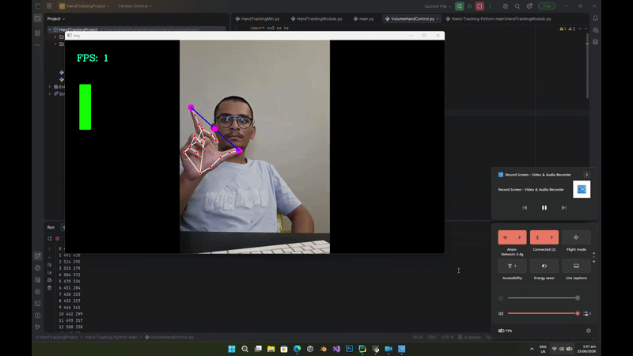

# Hand Volume Gesture Control

Control your system volume using hand gestures using Python, OpenCV, and MediaPipe.

This project uses computer vision to detect hand landmarks from a webcam feed and changes the system volume based on the distance between your thumb and index finger.

Perfect for learning:
- Computer Vision
- Hand Tracking
- OpenCV in Python
- MediaPipe
- Gesture Control Systems

---

## Features

- Real-time hand tracking
- Smooth volume control
- Finger distance detection
- FPS counter
- Simple and beginner-friendly code
- Uses webcam only

---

## Technologies Used

- Python
- OpenCV
- MediaPipe
- NumPy
- PyCaw

---


---

## Installation

Clone the repository:

```bash
git clone https://github.com/ahsinmemon/Hand-Volume-Gesture-Control.git
cd Hand-Volume-Gesture-Control
```

Install required packages:

```bash
pip install opencv-python mediapipe numpy pycaw comtypes
```

---

## How It Works

The program detects your hand using MediaPipe hand tracking.

* Thumb tip → Landmark 4
* Index finger tip → Landmark 8

The distance between these two fingers is calculated and mapped to the system audio range.

* Smaller distance = Lower volume
* Larger distance = Higher volume

---

## Run the Project

```bash
python VolumeHandControl.py
```

Make sure your webcam is connected.

---

## Controls

| Gesture                | Action          |
| ---------------------- | --------------- |
| Fingers close together | Lower volume    |
| Fingers far apart      | Increase volume |

---

## Project Structure

```bash
Hand-Volume-Gesture-Control/
│
├── HandTrackingModule.py
├── VolumeHandControl.py
├── README.md
```

## Project Demo 
md

---

## Learning Reference

This project is inspired by the computer vision tutorials from:

* Murtaza Hassan
* freeCodeCamp OpenCV Course
* Computer Vision Zone

---

## Future Improvements

* Better smoothing system
* Custom gestures
* Brightness control
* Multi-hand support
* UI overlay improvements

---


## Challenges Faced

One of the main challenges during development was dealing with package and dependency version mismatches because the original tutorial was created using older library versions.

Some functions and attributes had changed in newer releases of PyCaw and MediaPipe, which caused errors during implementation. These issues were resolved by debugging the code and adapting it to newer package versions.

---

## Author

### Ahsin Memon

* GitHub: https://github.com/ahsinmemon
* LinkedIn: https://www.linkedin.com/in/ahsin-memon-179bb5324

---

## License

This project is open-source and available under the MIT License.

```
```
